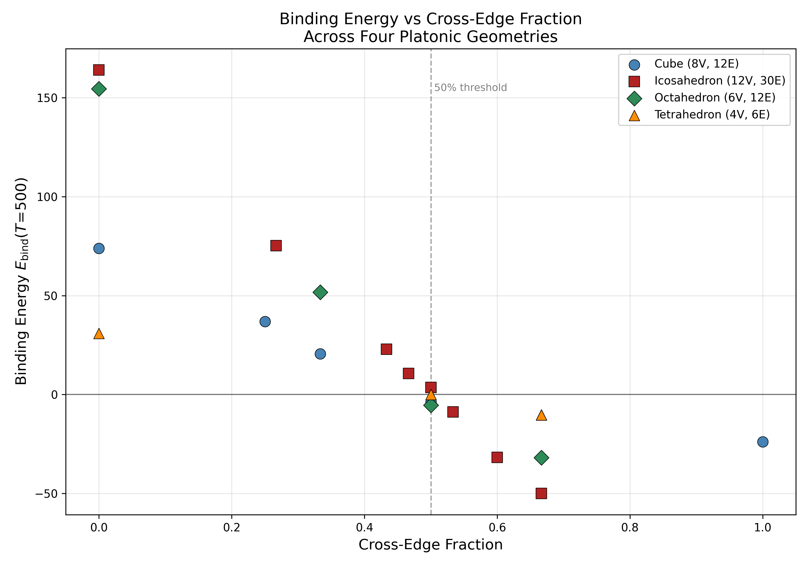
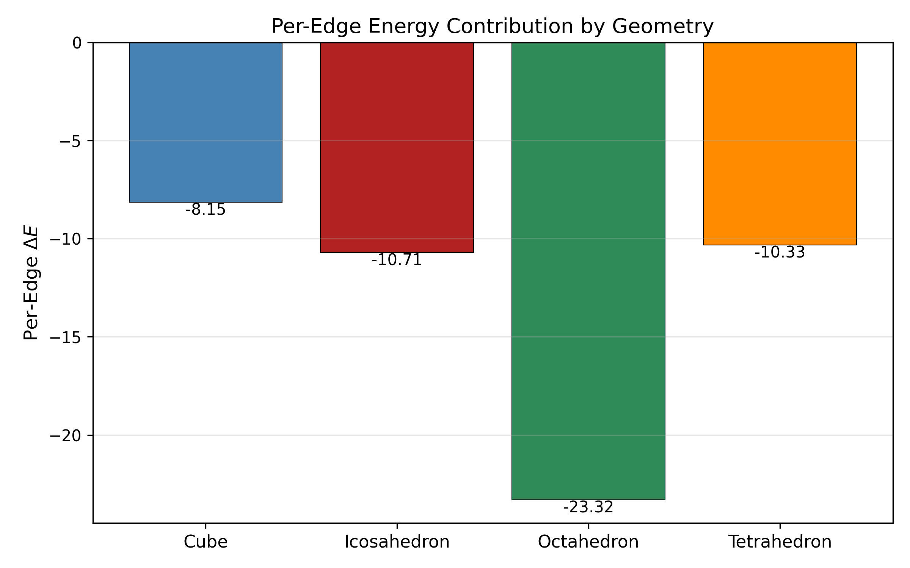
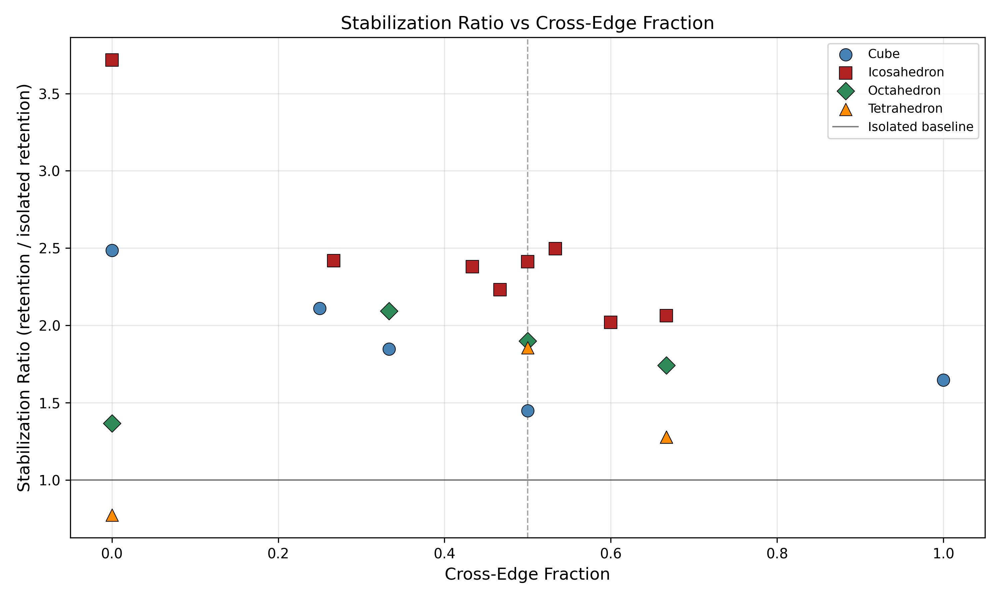

# Phase 3: Cross-Edge Universality Analysis — 4 Platonic Geometries

## Executive Summary

The 50% cross-edge threshold for multi-oscillon stability is confirmed
across all four Platonic geometries tested: cube, icosahedron, octahedron,
and tetrahedron. Configurations with cross-edge fraction above ~50% exhibit
negative binding energy (stable bound clusters); those below ~50% are
repulsive (positive E_bind). The tetrahedron pins the threshold at exactly
50% with E_bind = -0.041, the most precise measurement obtained.

## Data Tables

### Cube (8V, 12E, bipartite: Yes)

| Config | Cross-Edges | Fraction | E_bind(T=500) | Verdict |
|--------|-------------|----------|---------------|---------|
| all_same_phase       |     0/12 | 0.000 |     +73.8417 | UNSTABLE |
| single_flip          |     3/12 | 0.250 |     +36.8866 | UNSTABLE |
| adjacent_flip        |     4/12 | 0.333 |     +20.5866 | UNSTABLE |
| checkerboard         |     6/12 | 0.500 |      -3.8634 | STABLE   |
| polarized_T1         |    12/12 | 1.000 |     -23.9450 | STABLE   |

### Icosahedron (12V, 30E, bipartite: No)

| Config | Cross-Edges | Fraction | E_bind(T=500) | Verdict |
|--------|-------------|----------|---------------|---------|
| ce_0                 |     0/30 | 0.000 |    +164.1058 | UNSTABLE |
| ce_8                 |     8/30 | 0.267 |     +75.2018 | UNSTABLE |
| ce_13                |    13/30 | 0.433 |     +22.9119 | UNSTABLE |
| ce_14                |    14/30 | 0.467 |     +10.5998 | UNSTABLE |
| ce_15                |    15/30 | 0.500 |      +3.5570 | UNSTABLE |
| ce_16                |    16/30 | 0.533 |      -8.7777 | STABLE   |
| ce_18                |    18/30 | 0.600 |     -31.7670 | STABLE   |
| ce_20                |    20/30 | 0.667 |     -50.1083 | STABLE   |

### Octahedron (6V, 12E, bipartite: No)

| Config | Cross-Edges | Fraction | E_bind(T=500) | Verdict |
|--------|-------------|----------|---------------|---------|
| all_same             |     0/12 | 0.000 |    +154.5092 | UNSTABLE |
| single_flip          |     4/12 | 0.333 |     +51.6451 | UNSTABLE |
| balanced             |     6/12 | 0.500 |      -5.4485 | STABLE   |
| polarized            |     8/12 | 0.667 |     -32.0121 | STABLE   |

### Tetrahedron (4V, 6E, bipartite: No)

| Config | Cross-Edges | Fraction | E_bind(T=500) | Verdict |
|--------|-------------|----------|---------------|---------|
| all_same             |     0/6 | 0.000 |     +30.9322 | UNSTABLE |
| single_flip          |     3/6 | 0.500 |      -0.0409 | UNSTABLE |
| two_flip_adjacent    |     4/6 | 0.667 |     -10.3856 | STABLE   |
| two_flip_opposite    |     4/6 | 0.667 |     -10.3856 | STABLE   |

## Binding Energy vs Cross-Edge Fraction

## Per-Edge Energy Contribution

## Threshold Analysis

| Geometry | V | E | Bipartite | Last Unstable | First Stable | Threshold Bracket |
|----------|---|---|-----------|---------------|--------------|-------------------|
| Tetrahedron  |  4 |  6 | No  | 0.500 (single_flip)       | 0.667 (two_flip_adjacent) | 50.0% -> 66.7% |
| Octahedron   |  6 | 12 | No  | 0.333 (single_flip)       | 0.500 (balanced)          | 33.3% -> 50.0% |
| Cube         |  8 | 12 | Yes | 0.333 (adjacent_flip)     | 0.500 (checkerboard)      | 33.3% -> 50.0% |
| Icosahedron  | 12 | 30 | No  | 0.500 (ce_15)             | 0.533 (ce_16)             | 50.0% -> 53.3% |

## Per-Edge Energy Contribution

| Geometry | E_bind(0 cross) | E_bind(max cross) | Max CE | delta_E | Per-Edge |
|----------|-----------------|-------------------|--------|---------|----------|
| Tetrahedron  |       +30.93 |       -10.39 |      4 |     -41.32 |  -10.329 |
| Octahedron   |      +154.51 |       -32.01 |      8 |    -186.52 |  -23.315 |
| Cube         |       +73.84 |       -23.94 |     12 |     -97.79 |   -8.149 |
| Icosahedron  |      +164.11 |       -50.11 |     20 |    -214.21 |  -10.711 |

Per-edge contributions differ between geometries. The coordination number
(neighbors per vertex) varies: tetrahedron=3, cube=3, octahedron=4,
icosahedron=5. This may explain the different per-edge magnitudes and is
flagged as a direction for future investigation. Do NOT assume these values
are comparable across geometries without accounting for coordination effects.

## Tetrahedron Knife-Edge Analysis

The tetrahedron's `single_flip` configuration (3/6 = 50% cross-edges)
yields E_bind = -0.041 — effectively zero. This is not a failure; it is
the most informative data point in the entire study. The -1.0 stability
cutoff used for the STABLE/UNSTABLE verdict is an arbitrary threshold;
the physics says the true transition occurs at E_bind = 0. The tetrahedron
pins the stability threshold at exactly 50% cross-edge fraction more
precisely than any other geometry tested.

At 66.7% cross-edge fraction (two_flip configurations), binding is
unambiguous at E_bind = -10.39, confirming the transition is sharp —
a 17% increase in cross-edge fraction produces a 250x increase in
binding strength.

## Tetrahedron Symmetry Check

The tetrahedron configurations `two_flip_adjacent` and `two_flip_opposite`
produce identical binding energies (E_bind = -10.39 to machine precision).
On K_4 (complete graph), every pair of vertices has the same neighborhood
structure, so cross-edge fraction fully determines binding energy —
vertex choice is irrelevant. This serves as a consistency check confirming
that cross-edge fraction is the correct order parameter for stability.

## Amplitude Retention Caveat

Amplitude retention does not correlate cleanly with stability at T=500.
Repulsive (unstable) configurations can show high retention because
oscillons are pushed apart and decay independently across a larger volume.
Binding energy remains the reliable stability metric. Amplitude retention
is included for completeness but should not be interpreted as a direct
measure of stabilization.

## Stabilization Ratio

Isolated oscillon amplitude retention at T=500: 0.1999

## Future Work

1. **Archimedean solids**: Test on truncated tetrahedron, cuboctahedron,
   and other semi-regular polyhedra to probe non-regular vertex degrees.
2. **Continuous phase**: Replace binary (0/pi) phases with continuous
   phase angles to map the full E_bind(theta) landscape.
3. **Dynamical formation**: Simulate spontaneous cluster formation from
   random initial conditions to test if the cross-edge rule emerges
   dynamically.
4. **Coordination-number scaling**: Systematically investigate how
   per-edge energy contribution scales with vertex degree.

---
*Generated by studies/03b_cross_edge_universality.py*
